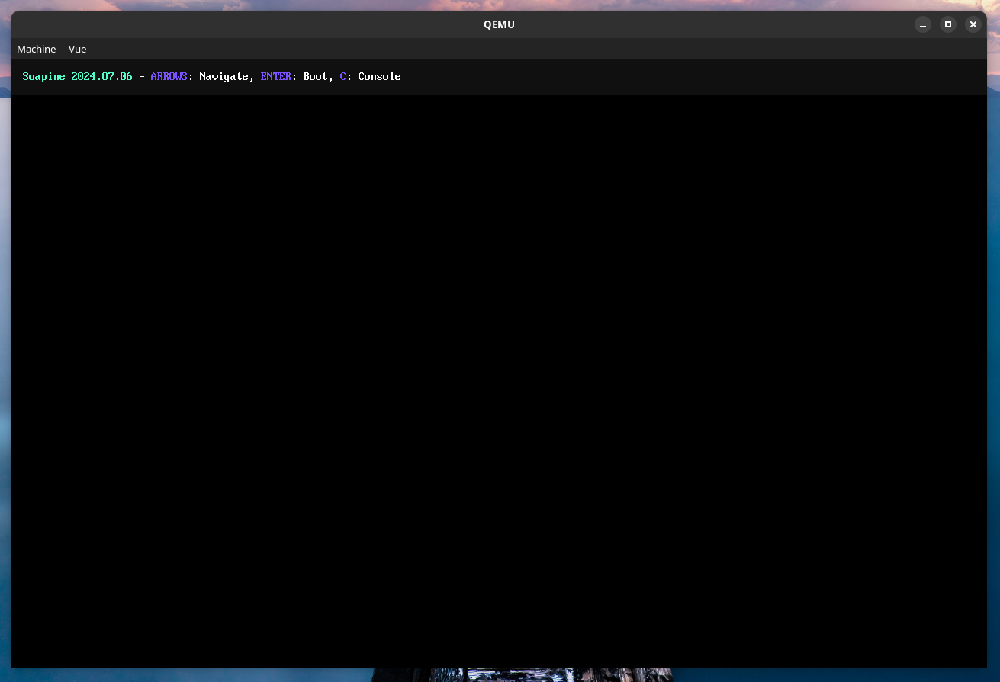

PS: Contributors wanted, Please DM `raphael23232_` (@RaphProductions) or `lolguy91` (@Lolguy91) on Discord to help

# Soapine
Soapine is an advanced bootloader that is made as an alternative to Limine.

</img>
*Soapine's menu on QEMU*

## Q&A
### Why making a Limine alternative?
We really like how Limine is powerful, but we fucking hate Limine's philosophy.

## Acknowledgements
Soapine uses all the third-party software/libraries/fonts mentioned below:

* NanoPrintF (by Charles Nicholson): A small, fast & header-only printf implementation.
* Simpterm (modified): The terminal that powers the lib/term FBTERM backend.
* JSMN: Soapine relies on JSMN to parse it's config file.
* The ZAP Group: Linux-like console fonts, used in Soapine